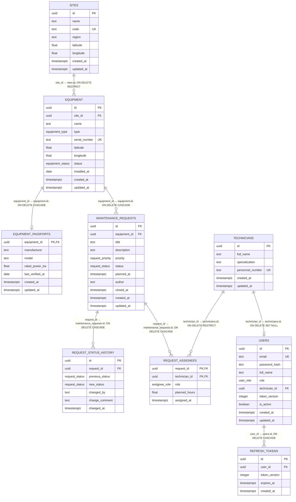

# Сервис учёта заявок на обслуживание оборудования

REST API на Express для учёта заявок на техническое обслуживание оборудования
производственных площадок (ветропарка). Данные хранятся в PostgreSQL.

Сервис:

- ведёт справочник площадок, оборудования, паспортов и специалистов;
- аутентифицирует пользователей по JWT и разграничивает доступ по ролям
  `viewer` / `technician` / `admin`;
- принимает и сопровождает заявки на обслуживание по таблице допустимых переходов
  статусов;
- назначает бригаду исполнителей и хранит append-only журнал переходов статуса;
- отдаёт сводку по площадке и отчёт по нагрузке на оборудование;
- оценивает погодные условия на объекте и пригодность «окна» для наружных работ
  (модуль из Кейса 1, внешний API open-meteo).

Доступ к данным идёт только через слой репозиториев: `маршруты → контроллеры →
сервисы → репозитории`. JSON-хранилище прошлой недели заменено на PostgreSQL
(Sequelize + umzug); контроллеры и бизнес-логика при этом не менялись.

## Стек

- Node.js ≥ 18 (используются глобальные `fetch` и `AbortSignal.timeout`), TypeScript, npm;
- Express 5, zod 4, pino (+ pino-http, pino-pretty);
- PostgreSQL 18 в Docker, Sequelize 6, umzug 3, pg 8;
- express-rate-limit, helmet, cors.

## Быстрый старт с нуля

```bash
# 1. Переменные окружения: значения по умолчанию локальные
cp .env.example .env

# 2. Зависимости
npm install

# 3. PostgreSQL: поднимается контейнер с томом pgdata,
#    роль приложения app_rw создаётся при инициализации кластера
docker compose up -d db
docker compose ps          # дождаться статуса healthy

# 4. Секреты подписи JWT: без них вход не работает
printf 'JWT_SECRET=%s\nJWT_REFRESH_SECRET=%s\nSEED_USERS=true\nBOOTSTRAP_ADMIN_PASSWORD=DemoAdminPass2026\nSEED_TECHNICIAN_PASSWORD=DemoTechPass2026\nSEED_VIEWER_PASSWORD=DemoViewerPass2026\n' \
  "$(openssl rand -hex 32)" "$(openssl rand -hex 32)" >> .env

# 5. Схема: 11 миграций создают enum-типы, 9 таблиц, индексы, триггер и права
npm run db:migrate

# 6. Сверка моделей Sequelize со схемой (9 таблиц)
npm run db:verify

# 7. Демо-данные (идемпотентно: повторный запуск добавляет 0 строк)
npm run db:seed

# 8. Сборка и запуск
npm run build
npm start                  # http://localhost:3000

# проверка доступности
curl localhost:3000/api/health     # {"status":"ok"}

# вход и защищённый эндпоинт
TOKEN=$(curl -s localhost:3000/api/auth/login -H 'Content-Type: application/json' \
  -d '{"email":"admin@example.test","password":"DemoAdminPass2026"}' | jq -r .accessToken)
curl -s localhost:3000/api/auth/me -H "Authorization: Bearer $TOKEN"
curl -s -o /dev/null -w '%{http_code}\n' localhost:3000/api/requests   # 401 без токена
```

Полезные команды разработки:

```bash
npm run dev                 # tsx watch с перезапуском
npm run typecheck           # tsc --noEmit
npm run db:migrate:status   # какие миграции применены, какие ожидают
npm run db:rollback         # откат последней миграции
npm run db:reset            # откат всех миграций (схема пуста)
npm run db:rollback-demo    # демонстрация отката транзакций
```

> Полный прогон коллекции Postman идёт по фиксированным серийным номерам
> (`SN-001`, `SN-003`, `DEMO-*`). Запускайте его на чистой базе:
> `npm run db:reset && npm run db:migrate && npm run db:seed`.
> Сценарий 429 расходует квоту частоты, поэтому коллекцию нельзя гонять
> дважды подряд без перезапуска сервера.

## Переменные окружения

Значения читаются один раз при старте (zod-схема в `src/config.ts`); при
некорректном значении процесс падает с перечислением проблем.

| Переменная | По умолчанию | Описание |
| --- | --- | --- |
| `NODE_ENV` | `development` | `development` \| `test` \| `production` |
| `HOST` | `0.0.0.0` | Адрес привязки |
| `PORT` | `3000` | Порт |
| `LOG_LEVEL` | `info` | `fatal` \| `error` \| `warn` \| `info` \| `debug` \| `trace` |
| `CORS_ORIGINS` | `http://localhost:3000,http://localhost:8080` | Разрешённые источники через запятую |
| `RATE_LIMIT_WINDOW_MS` | `60000` | Окно ограничения частоты запросов (мс) |
| `RATE_LIMIT_MAX` | `300` | Максимум запросов в окно |
| `BODY_LIMIT` | `100kb` | Максимальный размер тела запроса |
| `WEATHER_API_URL` | `https://api.open-meteo.com/v1/forecast` | Базовый URL погодного API |
| `REQUEST_TIMEOUT_MS` | `5000` | Таймаут обращения к погодному API (мс) |
| `WEATHER_FORECAST_DAYS` | `5` | Число дней прогноза (1–16) |
| `WEATHER_MAX_WIND_KMPH` | `15` | Порог максимальной скорости ветра, км/ч |
| `WEATHER_ALLOWED_PRECIPITATION_MM` | `0` | Допустимое количество осадков за день, мм |
| `DB_HOST` | `localhost` | Хост PostgreSQL |
| `DB_PORT` | `5432` | Порт PostgreSQL |
| `DB_NAME` | `appdb` | Имя базы |
| `DB_USER` | `app_rw` | Роль приложения: только DML |
| `DB_PASSWORD` | — | Пароль роли приложения |
| `DB_POOL_MAX` | `10` | Максимум соединений в пуле |
| `DB_POOL_IDLE_MS` | `30000` | Время жизни простоя соединения (мс) |
| `DB_POOL_ACQUIRE_MS` | `5000` | Таймаут получения соединения из пула (мс) |
| `DB_LOG_QUERIES` | `false` | Логировать SQL на уровне `debug` |
| `DB_CONNECT_RETRIES` | `10` | Сколько раз ждать БД при старте |
| `DB_RETRY_BASE_DELAY_MS` | `500` | Базовая задержка между попытками (мс) |
| `DB_MIGRATION_USER` | `postgres` | Роль с правом менять схему: только `db:migrate` и `db:seed` |
| `DB_MIGRATION_PASSWORD` | — | Пароль роли миграций |
| `TRUST_PROXY_HOPS` | `1` | Сколько обратных прокси доверять для `X-Forwarded-For` и `X-Forwarded-Proto` |
| `JWT_SECRET` | — | Секрет подписи access-токенов; в production не короче 32 символов |
| `JWT_REFRESH_SECRET` | — | Секрет подписи refresh-токенов; в production не короче 32 символов и не равен `JWT_SECRET` |
| `ACCESS_TOKEN_TTL_SEC` | `900` | Время жизни access-токена (секунды) |
| `REFRESH_TOKEN_TTL_SEC` | `604800` | Время жизни refresh-токена и его cookie (секунды) |
| `BCRYPT_ROUNDS` | `12` | Стоимость хеширования пароля |
| `REFRESH_COOKIE_NAME` | `refresh_token` | Имя cookie с refresh-токеном |
| `REFRESH_COOKIE_SECURE` | — | Флаг `Secure`; если не задан, берётся из `NODE_ENV` |
| `COOKIE_SAME_SITE` | `lax` | Политика `SameSite` для cookie с refresh-токеном |
| `LOGIN_RATE_LIMIT_WINDOW_MS` | `300000` | Окно лимита входа (мс) |
| `LOGIN_RATE_LIMIT_MAX` | `10` | Попыток входа на пару «IP + email» в окно |
| `SEED_USERS` | `false` | Создавать демо-пользователей в `db:seed` |
| `BOOTSTRAP_ADMIN_EMAIL` | `admin@example.test` | Email администратора демо-стенда |
| `BOOTSTRAP_ADMIN_PASSWORD` | — | Пароль администратора демо-стенда |
| `SEED_TECHNICIAN_EMAIL` | `technician@example.test` | Email техника демо-стенда |
| `SEED_TECHNICIAN_PASSWORD` | — | Пароль техника демо-стенда |
| `SEED_VIEWER_EMAIL` | `viewer@example.test` | Email наблюдателя демо-стенда |
| `SEED_VIEWER_PASSWORD` | — | Пароль наблюдателя демо-стенда |

`DATA_DIR` из прошлой недели больше не используется: JSON-хранилище удалено.

## База данных

### Роли и доступ

| Роль | Права | Кто использует |
| --- | --- | --- |
| `DB_MIGRATION_USER` (`postgres`) | суперпользователь, DDL | `db:migrate`, `db:seed`, `db:reset`, `db:verify` |
| `DB_USER` (`app_rw`) | `CONNECT`, `USAGE` на схеме и типах, `SELECT/INSERT/UPDATE/DELETE` на таблицах | сервер приложения, `db:seed`, `db:rollback-demo` |

Роль `app_rw` создаётся при первой инициализации кластера (`db/init`) и не имеет
права `CREATE` на схеме `public`, поэтому `create table` из приложения невозможен:

```
ERROR:  permission denied for schema public
```

Права выдаются и повторно фиксируются миграцией
`20260928000900-grant-app-role-privileges.ts`: она делает `GRANT` для уже
существующих таблиц и `ALTER DEFAULT PRIVILEGES` для будущих, поэтому
`db:seed` от имени `app_rw` работает без дополнительных настроек. `down` этой
миграции отзывает и текущие, и будущие права.

Пароли в репозитории отсутствуют: в git лежит только `.env.example`, `.env`
в `.gitignore`. Compose подставляет `DB_*` в переменные `POSTGRES_*` и
`APP_DB_*`, поэтому `.env` — единственный источник credentials.

### Модель данных

Девять таблиц в третьей нормальной форме. Аномалии вставки/обновления/удаления
устранены: справочники вынесены отдельно, повторяющиеся группы хранятся в
собственных таблицах, связи many-to-many — через таблицу-связь.



- **`sites`** — площадки. `code` уникален, есть индекс по `region`.
- **`equipment`** — оборудование площадки. `site_id` **nullable**: единица
  техники может существовать вне площадки (в сиде так оставлена подстанция
  `DEMO-SS-09`). `serial_number` уникален, координаты проверяются `CHECK`.
- **`equipment_passports`** — паспорт 1:1 к оборудованию (первичный ключ и
  одновременно внешний). `rated_power_kw > 0`.
- **`technicians`** — специалисты, `personnel_number` уникален.
- **`maintenance_requests`** — заявки. `status` по умолчанию `new`;
  `CHECK`-ограничение связывает статус и `closed_at`.
- **`request_status_history`** — журнал переходов. Первая запись заявки имеет
  `previous_status = NULL`.
- **`request_assignees`** — бригада заявки, составная PK
  `(request_id, technician_id)` и частичный уникальный индекс «не больше одного
  lead на заявку».
- **`users`** — учётные записи. `email` уникален, `password_hash` хранит
  только bcrypt-хеш, `technician_id` **nullable** и ссылается на специалиста из
  справочника (нужен, чтобы ограничить смену статуса заявки теми, на которых
  пользователь назначен). `token_version` — счётчик принудительного отзыва всех
  ранее выданных access-токенов, `is_active` — признак блокировки учётной
  записи администратором.
- **`refresh_tokens`** — выданные refresh-токены. Строка удаляется при
  использовании токена (ротация) и при выходе; по `user_id` можно отозвать все
  сессии пользователя, по `token_version` — отсечь токены, выпущенные до смены
  пароля. Индекс по `expires_at` обслуживает очистку истёкших записей.

### Нормализация и денормализация

Таблицы находятся в 3Н: у них есть первичные ключи, все зависимости — только от
ключа, нет транзитивных зависимостей и частичных зависимостей от составного
ключа. Справочник специалистов отделён от заявок, поэтому ФИО и табельный
номер хранятся один раз, а роли и плановые часы — в таблице-связи.

Осознанные отступления от 3Н, которых требует предметная область:

- **`equipment.latitude` / `equipment.longitude`** дублируют координаты
  площадки. Точка установки — физическая характеристика самой единицы техники
  (турбину могли переставить внутри площадки), а модуль погоды обязан отвечать
  без дополнительного `JOIN` к `sites`. Значения не синхронизируются
  автоматически: это снимок на момент создания/обновления оборудования.
  В сиде координаты площадки и стоящего на ней оборудования совпадают.
- **`request_status_history`** — денормализованный журнал: он дублирует статус
  заявки, иначе историю нельзя было бы показать. Компромисс описан в разделе
  «Отклонения».

### Типы, ключи, ограничения

Пять пользовательских enum-типов создаются первой миграцией и используются
моделями Sequelize через `DataTypes.ENUM`:

| Тип | Значения |
| --- | --- |
| `equipment_type` | `turbine`, `inverter`, `sensor`, `substation` |
| `equipment_status` | `operational`, `maintenance`, `fault`, `decommissioned` |
| `request_priority` | `low`, `medium`, `high`, `critical` |
| `request_status` | `new`, `in_progress`, `done`, `rejected` |
| `assignee_role` | `lead`, `member` |

Шестой тип `user_role` (`viewer`, `technician`, `admin`) создаёт миграция
пользователей: применённые миграции не переписываются, поэтому дописывать их
список нельзя. Полный перечень для сверки схемы с моделями — `ALL_ENUM_TYPES`
в `src/db/migrations/enum-types.ts`.

Ограничения целостности:

| Таблица | Ограничение |
| --- | --- |
| `sites` | `UNIQUE (code)`, `CHECK` на широту/долготу |
| `equipment` | `UNIQUE (serial_number)`, `CHECK` на широту/долготу, `FK site_id → sites(id) ON DELETE RESTRICT` |
| `equipment_passports` | `PK (equipment_id)`, `CHECK (rated_power_kw > 0)`, `FK → equipment(id) ON DELETE CASCADE` |
| `technicians` | `UNIQUE (personnel_number)` |
| `maintenance_requests` | `CHECK (status IN ('done','rejected') = (closed_at IS NOT NULL))`, `FK equipment_id → equipment(id) ON DELETE CASCADE` |
| `request_status_history` | `CHECK (previous_status IS NULL OR previous_status <> new_status)`, триггер `request_status_history_no_update`, `FK → maintenance_requests(id) ON DELETE CASCADE` |
| `request_assignees` | `PK (request_id, technician_id)`, `CHECK (planned_hours IS NULL OR planned_hours >= 0)`, частичный `UNIQUE (request_id) WHERE role = 'lead'`, `FK → maintenance_requests(id) ON DELETE CASCADE`, `FK → technicians(id) ON DELETE RESTRICT` |
| `users` | `UNIQUE (email)`, `CHECK (token_version >= 0)`, частичный `UNIQUE (technician_id) WHERE technician_id IS NOT NULL`, `FK → technicians(id) ON DELETE SET NULL` |
| `refresh_tokens` | `CHECK (token_version >= 0)`, `FK → users(id) ON DELETE CASCADE` |

Индексы:

| Таблица | Индексы |
| --- | --- |
| `sites` | `sites_region_idx` |
| `equipment` | `equipment_site_id_idx`, `equipment_status_idx`, `equipment_type_idx`, уникальный по `serial_number` |
| `technicians` | `technicians_specialization_idx`, уникальный по `personnel_number` |
| `maintenance_requests` | `maintenance_requests_equipment_id_idx`, `_status_idx`, `_priority_idx`, `_created_at_idx (DESC)` |
| `request_status_history` | `request_status_history_request_changed_idx (request_id, changed_at DESC)`, `request_status_history_changed_at_idx (changed_at DESC)` |
| `request_assignees` | `request_assignees_single_lead_idx` (частичный уникальный), `request_assignees_technician_id_idx` |
| `users` | `users_role_idx`, уникальный по `technician_id` (частичный) |
| `refresh_tokens` | `refresh_tokens_user_id_idx`, `refresh_tokens_expires_at_idx` |

### Время и часовые пояса

- Все метки времени — `timestamptz` (`created_at`, `updated_at`, `planned_at`,
  `closed_at`, `assigned_at`, `changed_at`); `installed_at` и
  `last_verified_at` — `date`, потому что это календарные даты без времени.
- Соединения открываются с `options: '-c timezone=UTC'`, поэтому
  `timestamptz` читается и пишется в UTC независимо от TZ хоста и контейнера;
  API отдаёт ISO-8601 с `Z`.
- Типы `DATE`, `NUMERIC` и `INT8` переопределены через `pg.types.setTypeParser`:
  `DATE` приходит строкой `YYYY-MM-DD` (иначе pg-драйвер сдвигает дату на сутки
  при локальной зоне), `NUMERIC` и `INT8` — числами (иначе строки в JSON).

### Правила удаления

| Действие | Что происходит |
| --- | --- |
| Удаление оборудования | `RESTRICT`, если на него ссылаются заявки; API дополнительно запрещает удаление при открытых заявках (`new`, `in_progress`) — **409**. Паспорт удаляется каскадом |
| Удаление заявки | Журнал переходов и назначения удаляются каскадом; оборудование и площадка остаются |
| Удаление площадки | `RESTRICT` при наличии оборудования. Отдельного эндпоинта удаления площадок нет |
| Удаление специалиста | `RESTRICT` при назначениях. Отдельного эндпоинта удаления специалистов нет |

### Миграции

Файлы `src/db/migrations/*.ts` выполняет umzug; каждый содержит `up` и `down`.
Схема версионируется таблицей `SequelizeMeta`.

| Миграция | `up` | `down` |
| --- | --- | --- |
| `20260928000100-create-enum-types` | 5 типов `CREATE TYPE` | `DROP TYPE` в обратном порядке |
| `20260928000200-create-sites` | таблица `sites`, индекс по `region` | `DROP TABLE` |
| `20260928000300-create-equipment` | таблица `equipment`, 3 индекса, 2 `CHECK`, уникальность | `DROP TABLE` |
| `20260928000400-create-equipment-passports` | таблица `equipment_passports` | `DROP TABLE` |
| `20260928000500-create-technicians` | таблица `technicians`, индекс, уникальность | `DROP TABLE` |
| `20260928000600-create-maintenance-requests` | таблица `maintenance_requests`, 4 индекса, `CHECK` статуса и `closed_at` | `DROP TABLE` |
| `20260928000700-create-request-status-history` | таблица журнала, 2 индекса, функция и триггер `BEFORE UPDATE` | `DROP TRIGGER`, `DROP FUNCTION`, `DROP TABLE` |
| `20260928000800-create-request-assignees` | таблица `request_assignees`, частичный уникальный индекс, `CHECK` | `DROP TABLE` |
| `20260928000900-grant-app-role-privileges` | `GRANT` роли приложения + `ALTER DEFAULT PRIVILEGES` | `REVOKE` и отзыв default privileges |
| `20261001000100-create-users` | тип `user_role`, таблица `users`, 2 индекса, уникальность, `CHECK` | `DROP TABLE`, `DROP TYPE` |
| `20261001000200-create-refresh-tokens` | таблица `refresh_tokens`, 2 индекса, `CHECK` | `DROP TABLE` |

```bash
npm run db:migrate          # применить неприменённые
npm run db:migrate:status   # список применённых и ожидающих
npm run db:rollback         # откатить последнюю (атомарно, в транзакции)
npm run db:reset            # откатить все (схема пуста)
```

`down` откатывает строго то, что сделал соответствующий `up` (включая триггер и
функцию), поэтому цепочка `up → down → up` воспроизводит то же состояние схемы.

`request_status_history_no_update` — триггер `BEFORE UPDATE FOR EACH ROW`,
поднимающий исключение с `ERRCODE = 23514`:

```
ERROR:  request_status_history is append-only: UPDATE is forbidden
```

### Демонстрация отката транзакций

`npm run db:rollback-demo` — самопроверяющийся сценарий, который создаёт
фикстуру (площадка, оборудование, специалист, заявка, запись журнала,
исполнитель) и проверяет три способа отката, сравнивая счётчики строк до и
после:

1. **неявный откат** — ошибка внутри `sequelize.transaction()` после вставок в
   четыре таблицы: не сохраняется ничего;
2. **явный откат** — успешные вставки и `transaction.rollback()` без ошибки;
3. **откат частичной операции** — `UPDATE` статуса, `INSERT` в журнал и
   `DELETE` исполнителя в одной транзакции: после сбоя статус, журнал и состав
   бригады не изменились.

```
[16:51:21] INFO: все сценарии отката подтверждены
    сценариев: 3
    строки: "sites=2 equipment=7 requests=21 history=40 assignees=12"
```

Скрипт возвращает ненулевой код выхода, если счётчики разошлись или база не
вернулась к исходному состоянию; фикстура удаляется в коммитящей транзакции,
поэтому повторный запуск ничего не меняет.

### Демо-данные

`npm run db:seed` идемпотентен: перед вставкой он удаляет записи с
идентификаторами из своего диапазона и вставляет заново, поэтому повторный
запуск печатает `added: 0`. Идентификаторы фиксированы
(`00000000-0000-4000-8000-…`), чтобы коллекция Postman и `db:rollback-demo`
могли ссылаться на одни и те же объекты.

| Таблица | Записей | Состав |
| --- | --- | --- |
| `sites` | 2 | `SITE-NORTH` (Московская область), `SITE-SOUTH` (Калужская область) |
| `equipment` | 6 | Турбина, датчик, инвертор, две подстанции, кабельная линия; `DEMO-SS-09` — вне площадок; кабельная линия `DEMO-C-05` отнесена к типу `sensor`, отдельного типа для линий в перечне ТЗ нет |
| `equipment_passports` | 3 | Для трёх единиц техники |
| `technicians` | 5 | Турбины, датчики, инверторы, кабельные линии, подстанции |
| `maintenance_requests` | 20 | 6 `new`, 5 `in_progress`, 5 `done`, 4 `rejected` |
| `request_status_history` | 39 | Полные цепочки переходов, начиная с `previous_status = NULL` |
| `request_assignees` | 12 | Назначения с плановыми часами |
| `users` | 3 | По одной учётной записи каждой роли; создаются, только если `SEED_USERS=true`, пароли берутся из `.env` |

Даты в сиде — январь…сентябрь 2026, поэтому фильтры по периоду в коллекции
(например, `dateFrom=2026-01-01`) возвращают непустой результат. У каждой
заявки в `in_progress` ровно один `lead`, что соответствует правилам API.

Пользователи создаются отдельной транзакцией **после** справочников: у
техника есть внешний ключ на `technicians`, поэтому специалисты должны
существовать раньше. Аккаунт без заданного в `.env` пароля пропускается с
предупреждением — в репозитории паролей нет. Учётная запись техника связана
со специалистом `EMP-0001`, поэтому его заявки (например,
`00000000-0000-4000-8000-000000000046`) он может менять, а чужие — нет.

## Эксплуатация

Порядок запуска в Docker, дежурные команды, типовые сбои, резервное
копирование и обновление вынесены в [docs/runbook.md](docs/runbook.md).

## Эндпоинты

| Метод | Путь | Назначение | Коды |
| --- | --- | --- | --- |
| `GET` | `/api/health` | Совместимость: признак работы процесса, без аутентификации | 200 |
| `GET` | `/api/health/live` | Liveness: процесс отвечает, без обращения к БД | 200 |
| `GET` | `/api/health/ready` | Readiness: проверка соединения с PostgreSQL | 200, 503 |
| `GET` | `/metrics` | Метрики Prometheus, без аутентификации | 200 |
| `GET` | `/api/docs` | Swagger UI, без аутентификации; можно закрыть `DOCS_ENABLED=false` | 200 |
| `GET` | `/api/docs/openapi.json` | Спецификация OpenAPI 3.1 | 200 |
| `POST` | `/api/auth/register` | Регистрация; роль всегда `viewer` | 201, 422 |
| `POST` | `/api/auth/login` | Вход, выдача access-токена и refresh-cookie | 200, 401, 422, 429 |
| `POST` | `/api/auth/refresh` | Ротация refresh-токена по cookie | 200, 401 |
| `POST` | `/api/auth/logout` | Выход: refresh-токен отзывается, cookie очищается | 204, 401 |
| `GET` | `/api/auth/me` | Текущий пользователь | 200, 401 |
| `GET` | `/api/equipment` | Список: фильтры `status`, `type`, `installedFrom`/`installedTo`, сортировка `sort`, пагинация `page`, `limit`, `offset` | 200, 400, 422 |
| `POST` | `/api/equipment` | Создание оборудования | 201, 409, 422 |
| `GET` | `/api/equipment/:id` | Карточка с паспортом | 200, 404 |
| `PATCH` | `/api/equipment/:id` | Частичное обновление | 200, 404, 409, 422 |
| `DELETE` | `/api/equipment/:id` | Удаление (запрещено при открытых заявках) | 204, 404, 409 |
| `GET` | `/api/equipment/:id/requests` | Заявки по оборудованию (те же фильтры) | 200, 404, 400, 422 |
| `GET` | `/api/equipment/:id/weather` | Прогноз и пригодность окна | 200, 404, 502 |
| `GET` | `/api/requests` | Список: фильтры `status`, `priority`, `equipmentId`, `dateFrom`/`dateTo` (по `createdAt`), `sort`, `page`, `limit`, `offset` | 200, 400, 422 |
| `POST` | `/api/requests` | Создание заявки | 201, 404, 422 |
| `GET` | `/api/requests/:id` | Карточка заявки с `assignees` | 200, 404 |
| `GET` | `/api/requests/:id/history` | Журнал переходов статуса, от свежих к старым | 200, 404 |
| `PATCH` | `/api/requests/:id` | Редактирование полей (`title`, `description`, `priority`, `plannedAt`) | 200, 404, 422 |
| `PATCH` | `/api/requests/:id/status` | Смена статуса с проверкой перехода и журналом | 200, 404, 409, 422 |
| `POST` | `/api/requests/:id/assignees` | Полная замена состава бригады | 201, 404, 409, 422 |
| `DELETE` | `/api/requests/:id/assignees/:technicianId` | Снятие исполнителя | 200, 404, 409 |
| `DELETE` | `/api/requests/:id` | Удаление заявки | 204, 404 |
| `GET` | `/api/sites/:id/summary` | Сводка по площадке | 200, 404 |
| `GET` | `/api/reports/equipment-load` | Отчёт по нагрузке на оборудование | 200, 400, 404, 422 |

> Во всех списках ответ имеет вид `{ data: [...], meta: { total, page, limit } }`.
> Одиночные ресурсы возвращаются объектом напрямую. При 201 выдаётся
> заголовок `Location`.

Кроме `/api/health*`, `/api/auth/*`, `/metrics` и `/api/docs` все эндпоинты
требуют заголовок `Authorization: Bearer <accessToken>`; без него — **401**.
Health-эндпоинты, `/metrics` и документация токена не требуют: их вызывает
балансировщик, система мониторинга и разработчик, а не пользователь. Доступ
извне закрывает nginx (см. «DevOps»).

### Роли и права

| Действие | viewer | technician | admin |
| --- | --- | --- | --- |
| Чтение справочников, заявок, истории, отчётов | ✓ | ✓ | ✓ |
| Создание и редактирование заявок | — | ✓ назначенным заявкам | ✓ |
| Смена статуса заявки | — | ✓ только назначенных заявок | ✓ |
| Назначение и снятие исполнителей | — | ✓ только назначенных заявок | ✓ |
| Удаление заявки | — | — | ✓ |
| Создание, правка и удаление оборудования | — | — | ✓ |
| Регистрация нового пользователя | даёт себе роль `viewer` | — | — |

Роль техника ограничена **назначением**: если специалист не входит в бригаду
заявки, редактирование, смена статуса и изменение состава дают **403**.
Повысить роль или выдать сессию за другого пользователя через API нельзя —
управление учётными записями идёт через SQL и сид.

### Сортировка и пагинация

- `sort=name` — по возрастанию, `sort=-name` — по убыванию. Поля сортировки для
  оборудования: `name`, `type`, `status`, `serialNumber`, `installedAt`,
  `createdAt`; для заявок: `priority`, `status`, `plannedAt`, `createdAt`,
  `updatedAt`. Неизвестное поле — **422**. Дополнительно по `id` как стабильный
  ключ, чтобы страницы не «плыли» при одинаковых значениях.
- `page` (≥1, по умолчанию 1), `limit` (1–100, по умолчанию 20),
  `offset` (0–10000, необязателен).
- `offset` приоритетнее `page`: если он задан, страница считается от него.
- Выход `page`/`limit`/`offset` за границы — **400** `BAD_REQUEST`, остальные
  нарушения схемы — **422**. Проверка вычисленного смещения тоже учитывается:
  `page=600&limit=20` даёт `offset = 11980` и отвергается с указанием на `page`.
- Пустой параметр запроса (`?status=`, `?sort=`, `?dateFrom=`) считается
  незаданным. Непустое, но некорректное значение — **422**.
- Диапазоны дат включительные; начало позже конца — **422**.

```json
{
  "error": {
    "code": "BAD_REQUEST",
    "message": "Параметры пагинации вне допустимого диапазона",
    "requestId": "d5671d1f-...",
    "details": [{ "field": "offset", "message": "offset не может превышать 10000" }]
  }
}
```

## Бизнес-логика заявок

### Схема переходов статусов

```
new ──────────► in_progress ──────────► done
 │                  │
 │                  ▼
 └──────────────► rejected
```

- `new → in_progress`, `new → rejected`, `in_progress → done`, `in_progress → rejected`;
- из `done` и `rejected` переходы запрещены — **409**;
- повторная установка текущего статуса — **409**;
- `in_progress` требует непустой бригады, иначе **409**
  («Перевод в статус «in_progress» требует назначенной бригады исполнителей»);
- тело `PATCH /status` принимает необязательный `comment`; он попадает в
  журнал вместе с `changedBy`, который берётся из access-токена;
- изменение статуса выполняется в одной транзакции: блокировка строки
  `SELECT … FOR UPDATE`, проверка перехода, проверка бригады, `UPDATE`,
  `INSERT` в журнал, чтение карточки. Конкурентные запросы получают 409 вместо
  двойной записи в журнал.

### Бригада заявки

`POST /api/requests/:id/assignees` полностью заменяет состав:

```json
{
  "assignees": [
    { "technicianId": "00000000-0000-4000-8000-000000000011", "role": "lead", "plannedHours": 6 },
    { "technicianId": "00000000-0000-4000-8000-000000000012", "role": "member", "plannedHours": 4 }
  ]
}
```

- 1–20 исполнителей, ровно один `lead` (на уровне схемы — **422**; на уровне БД
  защищает частичный уникальный индекс, ошибка переводится в **409**);
- `plannedHours` — неотрицательное число, необязательное;
- неизвестный специалист — **404** с перечнем `technicianIds` в `details`,
  прежний состав сохраняется (проверяется транзакцией);
- у заявки в `done`/`rejected` бригаду менять нельзя — **409**;
- снять `lead`, пока в бригаде есть другие специалисты, нельзя — **409**;
  снять единственного ведущего можно, бригада станет пустой;
- снятие не назначенного специалиста — **404**;
- оба ответа возвращают обновлённую карточку заявки.

### Журнал переходов

`GET /api/requests/:id/history` отдаёт `{ data: [...] }`, записи отсортированы
по `changed_at DESC`. Первая запись создаётся вместе с заявкой
(`previousStatus: null`, `newStatus: "new"`), поэтому цепочка
`new → in_progress → done` видна целиком — и для API, и для сида.

```json
{
  "data": [
    {
      "id": "00000000-0000-4000-8000-000000000045",
      "requestId": "00000000-0000-4000-8000-000000000032",
      "previousStatus": "in_progress",
      "newStatus": "done",
      "changedBy": "Петрова Анна Сергеевна",
      "comment": "Связь восстановлена",
      "changedAt": "2026-02-20T15:00:00.000Z"
    }
  ]
}
```

## Отчёты

Оба отчёта считаются прямым SQL в репозитории (Sequelize `query` с
`replacements`), без загрузки строк в память. Агрегаты выполняет PostgreSQL.

### Сводка по площадке

`GET /api/sites/:id/summary` — один `SELECT` с двумя `LEFT JOIN`-агрегатами по
заявкам плюс `COUNT` по оборудованию. Нулевые значения по статусам и
приоритетам присутствуют в ответе, а не отсутствуют; `averageCloseSeconds` —
`null`, если закрытых заявок не было.

```json
{
  "siteId": "00000000-0000-4000-8000-000000000001",
  "siteName": "Площадка Северная",
  "siteCode": "SITE-NORTH",
  "region": "Московская область",
  "equipmentTotal": 3,
  "requestsTotal": 11,
  "byStatus": { "new": 2, "in_progress": 5, "done": 3, "rejected": 1 },
  "byPriority": { "low": 3, "medium": 4, "high": 2, "critical": 2 },
  "averageCloseSeconds": 384150
}
```

Неизвестная площадка — **404**. Для `SITE-SOUTH`: 2 единицы техники, 7 заявок,
среднее время закрытия 248100 с.

### Нагрузка на оборудование

`GET /api/reports/equipment-load` — фильтры `dateFrom`, `dateTo` (по
`created_at`), `siteId`, `status`, `priority`, `limit` (1–100, по умолчанию 20).
Сумма плановых часов берётся `LATERAL`-подзапросом по назначениям, поэтому N+1
запросов нет; строки отсортированы по убыванию числа заявок, затем по убыванию
плановых часов и по `id`, лишние строки обрезаются на уровне БД.

```json
{
  "data": [
    {
      "equipmentId": "00000000-0000-4000-8000-000000000021",
      "serialNumber": "DEMO-T-01",
      "equipmentName": "Турбина Т-1",
      "siteId": "00000000-0000-4000-8000-000000000001",
      "siteName": "Площадка Северная",
      "requestsTotal": 5,
      "requestsClosed": 1,
      "plannedHours": 36,
      "lastServicedAt": "2026-06-18T14:30:00.000Z"
    }
  ],
  "applied": { "dateFrom": "2026-01-01", "dateTo": "2026-12-31", "limit": 3 }
}
```

`applied` возвращает фактически применённые фильтры — удобно для отладки и
кэширования на стороне клиента. Оборудование без заявок в выборку не попадает
(`INNER JOIN`), `lastServicedAt` — `null`, если закрытых заявок не было.
`limit` вне диапазона — **400**, `dateFrom > dateTo` — **422**.

## Формат ответа об ошибке

Все ошибки возвращаются в едином формате:

```json
{
  "error": {
    "code": "VALIDATION_ERROR",
    "message": "Некорректные данные запроса",
    "details": [{ "field": "priority", "message": "Недопустимый приоритет" }],
    "requestId": "b1f2c3d4-..."
  }
}
```

`details` присутствует только у ошибок валидации. `requestId` совпадает с
заголовком `X-Request-Id` ответа и с идентификатором запроса в логах. В
`production` у **не-операционных** ответов 5xx скрываются внутренние сообщения
и стек-трейсы: клиент видит `INTERNAL_ERROR`, причина остаётся в логах.
Операционные ошибки приложения несут текст, специально написанный для клиента,
поэтому не маскируются ни в каком окружении.

| Код | HTTP | Когда |
| --- | --- | --- |
| `UNAUTHORIZED` | 401 | Нет токена, токен недействителен или истёк, неверные учётные данные |
| `FORBIDDEN` | 403 | Роль не даёт права на операцию либо техник не назначен на заявку |
| `VALIDATION_ERROR` | 422 | Некорректные поля body/query/params |
| `BAD_REQUEST` | 400 | Выход `page`/`limit`/`offset` за диапазон |
| `INVALID_JSON` | 400 | Битый JSON в теле |
| `PAYLOAD_TOO_LARGE` | 413 | Тело больше `BODY_LIMIT` |
| `NOT_FOUND` | 404 | Ресурс/эндпоинт не найден |
| `CONFLICT` | 409 | Дубль серийного номера / табельного номера, недопустимый переход статуса, `in_progress` без бригады, два `lead`, изменение бригады у закрытой заявки, удаление оборудования с открытыми заявками |
| `RATE_LIMIT_EXCEEDED` | 429 | Превышен лимит частоты запросов |
| `EXTERNAL_API_ERROR` | 502 | Погодный API недоступен/ошибся |
| `INTERNAL_ERROR` | 500 | Необработанная ошибка |

Ошибки PostgreSQL переводятся в доменные: `23503` (`NOT_FOUND`), `23505`
(`CONFLICT`), `23514` — `CONFLICT` для прикладных ограничений и `BAD_REQUEST`
для битых параметров запроса.

## Примеры запросов и ответов

### Вход и защищённый запрос

```bash
curl -s localhost:3000/api/auth/login -H 'Content-Type: application/json' \
  -d '{"email":"admin@example.test","password":"DemoAdminPass2026"}'
```

```json
{
  "accessToken": "eyJhbGciOiJIUzI1NiIsInR5cCI6IkpXVCJ9...",
  "tokenType": "Bearer",
  "expiresIn": 900,
  "user": {
    "id": "3d4a5f6e-...",
    "email": "admin@example.test",
    "fullName": "Администратор системы",
    "role": "admin",
    "technicianId": null
  }
}
```

Одновременно в ответе появляется `Set-Cookie: refresh_token=…; HttpOnly; SameSite=Lax;
Path=/api/auth`, поэтому браузер хранит refresh-токен недоступным для JavaScript.
Дальше access-токен передаётся в заголовке:

```bash
curl -s localhost:3000/api/requests -H "Authorization: Bearer $TOKEN"
```

### Создание оборудования

```http
POST /api/equipment
Content-Type: application/json

{
  "name": "Ветрогенератор W-01",
  "type": "turbine",
  "serialNumber": "SN-001",
  "location": { "lat": 54.35, "lon": 37.61 },
  "installedAt": "2024-05-01"
}
```

```json
{
  "id": "5b3e5f1c-...",
  "name": "Ветрогенератор W-01",
  "type": "turbine",
  "serialNumber": "SN-001",
  "location": { "lat": 54.35, "lon": 37.61 },
  "status": "operational",
  "installedAt": "2024-05-01",
  "createdAt": "2026-09-28T09:51:45.147Z",
  "updatedAt": "2026-09-28T09:51:45.147Z"
}
```

Дубль серийного номера:

```json
HTTP/1.1 409 Conflict
{
  "error": {
    "code": "CONFLICT",
    "message": "Оборудование с серийным номером «SN-001» уже существует",
    "requestId": "..."
  }
}
```

### Карточка заявки

`GET /api/requests/:id` возвращает заявку вместе с бригадой; исполнители
приходят одним `include`, без дополнительных запросов:

```json
{
  "id": "00000000-0000-4000-8000-000000000031",
  "equipmentId": "00000000-0000-4000-8000-000000000021",
  "title": "Плановое ТО турбины",
  "description": "Замена масла в редукторе, проверка затяжки болтов",
  "priority": "medium",
  "status": "in_progress",
  "plannedAt": "2026-03-10T09:00:00.000Z",
  "author": "seed",
  "createdAt": "2026-02-01T08:00:00.000Z",
  "updatedAt": "2026-03-09T07:30:00.000Z",
  "assignees": [
    {
      "requestId": "00000000-0000-4000-8000-000000000031",
      "technicianId": "00000000-0000-4000-8000-000000000011",
      "role": "lead",
      "plannedHours": 8,
      "assignedAt": "2026-09-28T09:51:45.147Z",
      "fullName": "Иванов Иван Иванович",
      "specialization": "Турбины",
      "personnelNumber": "EMP-0001"
    }
  ]
}
```

### Недопустимый переход статуса

```http
PATCH /api/requests/:id/status
Content-Type: application/json
{ "status": "new" }        // заявка уже в статусе done
```

```json
HTTP/1.1 409 Conflict
{
  "error": {
    "code": "CONFLICT",
    "message": "Переход из статуса «done» в «new» недопустим",
    "requestId": "..."
  }
}
```

### Перевод в работу без бригады

```json
HTTP/1.1 409 Conflict
{
  "error": {
    "code": "CONFLICT",
    "message": "Перевод в статус «in_progress» требует назначенной бригады исполнителей",
    "requestId": "..."
  }
}
```

### Снятие ведущего из непустой бригады

```json
HTTP/1.1 409 Conflict
{
  "error": {
    "code": "CONFLICT",
    "message": "Нельзя снять ведущего, пока в бригаде назначены другие специалисты: сначала замените lead",
    "requestId": "..."
  }
}
```

### Неизвестный специалист

```json
HTTP/1.1 404 Not Found
{
  "error": {
    "code": "NOT_FOUND",
    "message": "Специалист не найден",
    "requestId": "...",
    "details": {
      "technicianIds": ["00000000-0000-4000-8000-0000000000ff"]
    }
  }
}
```

### Прогноз погоды и пригодность окна

```http
GET /api/equipment/:id/weather
```

```json
{
  "equipmentId": "5b3e5f1c-...",
  "location": { "lat": 54.35, "lon": 37.61 },
  "rule": { "maxWindKmph": 15, "allowedPrecipitationMm": 0, "forecastDays": 5 },
  "forecast": [
    { "date": "2026-09-21", "tempMax": 20.1, "tempMin": 11.3, "precipitationMm": 0, "windMaxKmph": 9.4, "suitable": true },
    { "date": "2026-09-22", "tempMax": 18.4, "tempMin": 12.0, "precipitationMm": 5.8, "windMaxKmph": 15.5, "suitable": false }
  ]
}
```

**Правило пригодности окна наружных работ**: день пригоден, если за сутки
выпало не более `WEATHER_ALLOWED_PRECIPITATION_MM` осадков **и** максимальная
скорость ветра ниже `WEATHER_MAX_WIND_KMPH`. Пороги задаются переменными
окружения, единицы измерения совпадают с единицами внешнего API (км/ч и мм).
Координаты берутся из `equipment.latitude`/`longitude`, поэтому модуль не
делает `JOIN` с площадками. Если погодный API недоступен, сервис не падает и
отвечает **502** `EXTERNAL_API_ERROR`.

## Мониторинг

Prometheus забирает метрики приложения изнутри сети compose (снаружи `/metrics`
закрыт nginx), Grafana показывает их на дашборде и считает свои правила.
Оба сервиса слушают только loopback:

```bash
docker compose up -d prometheus grafana   # подни только мониторинг
docker compose ps prometheus grafana

# Prometheus
curl -s http://127.0.0.1:9090/api/v1/targets | jq '.data.activeTargets[] | {job: .labels.job, health}'
curl -s http://127.0.0.1:9090/api/v1/rules   | jq '.data.groups[].rules[] | {name, state, health}'

# Grafana: http://localhost:3001 (логин из GRAFANA_ADMIN_USER / GRAFANA_ADMIN_PASSWORD)
```

Всё настраивается файлами, руками ничего править не нужно:

| Файл | Что делает |
| --- | --- |
| `deploy/prometheus/prometheus.yml` | Сбор метрик `app` раз в 15s (столько же, сколько healthcheck контейнера) и самого Prometheus |
| `deploy/prometheus/alerts.yml` | 8 правил в группах availability / errors / latency / resources |
| `deploy/grafana/provisioning/datasources/prometheus.yml` | Источник данных с фиксированным `uid: prometheus` |
| `deploy/grafana/provisioning/dashboards/dashboards.yml` | Провайдер дашбордов из `/var/lib/grafana/dashboards` |
| `deploy/grafana/provisioning/alerting/alerting.yml` | 3 правила unified alerting |
| `deploy/grafana/dashboards/service-overview.json` | Дашборд из 12 панелей, домашний по умолчанию |

Дашборд **Service overview** начинается с доступности и состояния базы,
дальше — rpm, доля 5xx, p95, очередь и время работы процесса, затем графики
RPS по маршрутам, коды ответов, квантили задержки, куча и RSS, ЦП и задержка
event loop. Панели времени отклика переключают цвет по порогам (p95 желтеет
с 0.5 с, краснеет с 1 с; доля 5xx — с 1% и 5%), поэтому «жёлтый» читается
сразу. Переменная `route` фильтрует все запросные панели сразу; аннотация
отмечает перезапуски процесса — по ней видно, что деплой прошёл.

Правила Prometheus:

| Алерт | Условие | Severity |
| --- | --- | --- |
| `ServiceDown` | `up{job="app"} == 0` дольше 2 минут | critical |
| `DatabaseUnavailable` | `app_database_up == 0` дольше минуты | critical |
| `HighErrorRate` | доля ответов 5xx выше 5% за 5 минут | warning |
| `NoTraffic` | нет ни одного запроса за 15 минут | info |
| `SlowRequests` | p95 всех маршрутов выше 1 с дольше 10 минут | warning |
| `RequestQueueGrowing` | среднее `http_requests_in_flight` выше 50 | warning |
| `HighHeapUsage` | занято больше 85% кучи V8 | warning |
| `CpuSaturation` | процесс использует больше 0.9 ядра | warning |

Три из них продублированы в Grafana, чтобы видеть состояние и историю без
Prometheus Alertmanager: недоступность приложения, недоступность базы и
p95 выше секунды. Условия те же, `for` — те же.

Проверено на этой машине: оба target'а Prometheus `up`, все 8 правил
`health=ok`, дашборд и datasource загрузились, 15 запросов дашборда возвращают
данные. Алерты проверены не «на глаз», а по факту падений:

- `docker compose stop db` → через минуту сработал `DatabaseUnavailable`
  (critical), `/api/health/ready` отдавал 503, `/api/health/live` — 200;
  после `docker compose start db` алерт снялся, а `HighErrorRate` на
  пять минут поднялся сам — 503 во время падения действительно были;
  сейчас активных алертов нет;
- метрики в правилах сверены с фактическими именами: приложение на Node,
  поэтому вместо `go_memstats_*` используется `app_nodejs_heap_size_used_bytes`
  и `app_process_cpu_seconds_total`. Неправильное имя не даёт ошибки в
  конфиге, но правило молча никогда не сработает.

## Прокси nginx

Публичная точка входа — контейнер nginx. Наружу открыт только порт 80
(в compose пробрасывается как `8080`): приложение и база слушают внутреннюю
сеть и портов на хосте не имеют, проверить это можно так:

```bash
curl -s -o /dev/null -w '%{http_code}\n' --max-time 3 http://localhost:3000/api/health/live  # 000 — соединения нет
curl -s -o /dev/null -w '%{http_code}\n' http://localhost:8080/api/health/ready              # 200
```

`deploy/nginx/conf.d/app.conf` решает четыре задачи:

| Что | Как | Зачем |
| --- | --- | --- |
| Заголовки доверия | `Host`, `X-Real-IP`, `X-Forwarded-For`, `X-Forwarded-Proto` | Приложение доверяет одному прокси (`TRUST_PROXY_HOPS=1`) и берёт из этих заголовков реальный IP клиента: от него зависят лимиты частоты и запись `ip` при входе |
| Идентификатор запроса | `X-Request-Id: $request_id` | Приложение принимает готовый id и возвращает его клиенту, поэтому номер из логов nginx совпадает с номером в логах приложения и в ответе клиенту |
| Лимиты и таймауты | `client_max_body_size 1m`, `client_body_timeout`, `proxy_connect_timeout`, `proxy_read_timeout`, `proxy_send_timeout` | Тело ограничивается до того, как его примет приложение, а зависший бэкенд не держит соединение с клиентом |
| Закрытые маршруты | `location = /metrics` → 404, `/healthz` → 200, `/` → статическая страница | Метрики показывают пути, статусы и внутренние id; наружу их не пускают, а Prometheus забирает изнутри сети |

Ещё несколько решений, которые видно в конфигурации:

- `proxy_set_header Connection ""` вместе с `keepalive 32` в `upstream`:
  соединение к бэкенду переиспользуется, но nginx ждёт не больше
  `proxy_read_timeout` — при рестарте приложения клиенты не зависают на
  минуту.
- `proxy_buffering off`: ответы API маленькие, буферизация только задерживала
  бы первую строку JSON.
- Заголовки безопасности не дублируются: их ставит Helmet внутри
  приложения, `proxy_hide_header Server` убирает только технический
  `Server: nginx`.
- gzip включён для текстовых типов (`application/json`, `text/css`,
  `text/javascript`, …) с `gzip_min_length 1024`; спецификация OpenAPI
  сжимается с 38 КБ до 7 КБ.
- Формат логов nginx — JSON с теми же полями, что у pino (`request_id`,
  `request_time`, `upstream_response_time`), поэтому записи двух слоёв
  склеиваются по времени.
- Конфигурация и статика смонтированы `read-only`, а `/var/cache/nginx` и
  `/var/run` — в `tmpfs`: прокси не может переписать конфиг и не оставляет
  мусор в слое.
- Стартовая страница `deploy/nginx/html/index.html` ведёт на Swagger UI и
  health-check — с неё начинается разбор, когда сервис только подняли.

Проверено: `GET /` 200, `/api/docs/` 200, `/api/docs/openapi.json` 200 с
`Content-Encoding: gzip`, `/api/health/ready` 200, `/metrics` 404,
`nginx -t` — конфигурация корректна, `X-Request-Id` в ответе совпадает с
записью в логах приложения, а полный прогон коллекции через прокси
(`--env-var baseUrl=http://localhost:8080`) проходит без ошибок.

## Запуск в Docker

Локально без Docker сервис поднимается как раньше (см. «Быстрый старт»), но
полный стек собирается в контейнерах: там же проверяется то, как он будет
работать на сервере.

```bash
cp .env.example .env      # заполнить DB_*, JWT_SECRET, JWT_REFRESH_SECRET
openssl rand -hex 32      # значения для JWT_SECRET и JWT_REFRESH_SECRET
npm run docker:up         # docker compose up -d --build
docker compose ps
```

Три сервиса, порядок запуска задан зависимостями, а не документацией:

1. **db** — PostgreSQL 18 с `pg_isready`-healthcheck и ролью `app_rw`,
   создаваемой скриптом `db/init`. Данные живут в именованном томе `pgdata`.
2. **migrate** — разовый контейнер: `npm run db:migrate`, затем
   `npm run db:seed` из уже собранного образа. Он же владеет правом менять
   схему, потому что запускается от `DB_MIGRATION_USER`.
3. **app** — само приложение от роли `DB_USER`, у которой нет прав на DDL.
   Стартует только после `service_completed_successfully` у `migrate`,
   поэтому первый запрос не увидит пустую схему.

```bash
npm run docker:logs       # логи приложения
npm run docker:ps         # статусы
npm run docker:down       # остановить, данные и том останутся
npm run docker:reset      # остановить и удалить том (данные пропадут)
```

Решения, которые видно в `Dockerfile` и `compose.yaml`:

- **Node 24 bookworm-slim, а не alpine**: `bcrypt` — нативный модуль, под
  alpine нужен тулчейн для сборки, здесь подходит готовый бинарник.
- **Три стадии**: `build` ставит всё и компилирует TypeScript, `prod-deps`
  делает `npm prune --omit=dev`, `runtime` получает только `dist`,
  production-зависимости и `db/init`. TypeScript и tsx в образ не идут.
- **Непривилегированный пользователь**: `USER node`, поэтому запись в файлы
  приложения невозможна даже при ошибке в коде.
- **`CMD`, а не `ENTRYPOINT`**: `compose` переопределяет `command` у сервиса
  миграций, а `ENTRYPOINT` его перебил бы и запустил вместо миграций сервер.
  При этом `node` остаётся PID 1 и получает `SIGTERM` напрямую, поэтому
  graceful shutdown работает (в логах видно `"msg":"shutting down"`).
- **Healthcheck приложения** бьёт в `/api/health/ready`, а не в `/live`:
  балансировщик не должен слать трафик в контейнер без базы.
- **Обязательные переменные** помечены как `${JWT_SECRET:?...}`: если забыть
  секрет, `compose` падает сразу с понятным сообщением, а не контейнер
  стартует и падает уже в цикле перезапуска.

Проверено на этой машине: `docker compose up -d --build` поднимает стек с
нуля, `migrate` применяет 11 миграций и грузит демо-данные, `app` становится
`healthy`, повторный `up` идемпотентен («демо-данные уже были загружены»),
данные переживают `docker compose down` без `-v`, а роль приложения не может
создать таблицу (`permission denied`).

## Безопасность

- **CORS.** Разрешены только источники из `CORS_ORIGINS` (список через запятую),
  «звёздочка» не используется. Для демо разрешены `http://localhost:3000` и
  `http://localhost:8080`; в production список заменяется реальными доменами.
- **Rate limiting.** На все маршруты `/api` действует лимит `RATE_LIMIT_MAX`
  запросов за `RATE_LIMIT_WINDOW_MS` мс. При превышении — `429` с заголовками
  `RateLimit-*` (draft-8) и ответом в едином формате ошибки. Лимит считается в
  памяти процесса, поэтому при нескольких инстансах он не общий.
- **Защитные заголовки** — `helmet`; размер тела ограничен `BODY_LIMIT` (100kb)
  → `413`.
- **Пароли.** Хранится только bcrypt-хеш (`BCRYPT_ROUNDS`, по умолчанию 12) в
  колонке `password_hash`. Проверка неверного пароля и несуществующего email
  занимает одинаковое время (~215 мс при cost 12): для неизвестного email
  сравнение идёт с одноразовым хешем-заглушкой, поэтому по времени ответа не
  видно, существует ли аккаунт. Текст ошибки один и тот же — «Неверный email или
  пароль». Хеши и пароли не попадают в логи: pino вырезает `authorization`,
  `cookie`, `*.password` и `*.token`.
- **Токены.** Access-токен — JWT (`HS256`) с `sub`, `email`, `name`, `role`,
  `technicianId`, `kind` и сроком 15 минут, отдаётся в теле ответа и хранится
  у клиента. Refresh-токен — JWT с другим секретом и `jti`, равным `id` строки
  в `refresh_tokens`, и отдаётся только в HttpOnly-cookie
  (`Secure` в production, `SameSite=Lax`, `Path=/api/auth`) — из JavaScript он
  недоступен. Пересечение двух секретов проверяется: access-токен нельзя
  предъявить как refresh и наоборот.
- **Ротация и повторное использование.** Каждый `POST /auth/refresh` в одной
  транзакции удаляет использованную строку и создаёт новую. Если пришёл уже
  использованный или отозванный токен, сервис считает это попыткой кражи,
  отзывает все сессии пользователя и поднимает `token_version`, после чего
  все ранее выданные refresh-токены становятся непригодными. Побочный эффект
  тот же, что у всех реализаций ротации: если refresh выполнить дважды
  параллельно (например, из двух вкладок), «проигравший» запрос закрывает
  сессии — считается, что токен мог попасть в чужие руки. Выход идемпотентен и
  всегда отвечает 204, даже если cookie пустая или токен истёк.
- **Лимит входа.** У `POST /api/auth/login` отдельный счётчик на пару
  «IP + email»: 10 попыток за 5 минут по умолчанию. IP берётся из
  `req.ip`, то есть из `X-Forwarded-For` доверенного nginx, а не из
  произвольного заголовка клиента.
- **Доверие прокси.** `app.set('trust proxy', TRUST_PROXY_HOPS)` — по умолчанию
  один nginx. Запросы без валидного токена не доходят до бизнес-логики:
  `authenticate()` стоит до маршрутов, `requireRole()` — до валидации тела.
- **SQL-инъекции.** Пользовательские значения подставляются только через
  `replacements` Sequelize (параметризованные запросы). Имена колонок для
  сортировки берутся из белого списка, а не из пользовательского ввода.
- **Роли.** Приложение работает на `app_rw` без права менять схему: даже
  SQL-инъекция в приложении не даст `CREATE TABLE`, `DROP` или доступ к
  чужим схемам.
- **Секреты.** В репозитории только `.env.example`; `.env` в `.gitignore`.
  В `production` стек-трейсы и внутренние сообщения не попадают в ответ
  не-операционных ошибок.
- **CORS и cookie.** `credentials: true` в CORS — refresh-cookie отправляется
  браузером только для разрешённого источника из `CORS_ORIGINS`.

### Известные уязвимости зависимостей

`npm audit` сообщает о 2 умеренных предупреждениях:

```
uuid  <11.1.1
Severity: moderate
uuid: Missing buffer bounds check in v3/v5/v6 when buf is provided
https://github.com/advisories/GHSA-w5hq-g745-h8pq
```

`uuid@8.3.2` приходит транзитивно из `sequelize@6.37.8` и используется только
внутри Sequelize для генерации идентификаторов. Уязвимость касается функций
`v3/v5/v6` при передаче пользовательского буфера — сервис их не вызывает и
идентификаторы не принимает от клиента. Обновление возможно только вместе с
 Sequelize (`npm audit fix --force` предлагает откат на `sequelize@3.30.0`),
поэтому пакет зафиксирован на текущей версии и риск принят осознанно.

## Документация API

- `GET /api/docs` — Swagger UI: интерактивный список операций с возможностью
  выполнить запрос («Try it out»).
- `GET /api/docs/openapi.json` — спецификация OpenAPI 3.1 в JSON. Её можно
  импортировать в Postman, Insomnia или сгенерировать клиент.
- Спецификация описана вручную в `src/docs/openapi.ts`: zod-схемы проверяют
  запрос, но не описывают ответ, а ответы различаются по кодам и ролям.
  Альтернатива — генерировать документ из zod, но тогда описание операций
  всё равно приходится дописывать руками.
- Документация смонтирована **до** `authenticate()`: иначе нельзя было бы
  открыть страницу, чтобы узнать, как получить токен. Закрыть её на
  production можно двумя способами: `DOCS_ENABLED=false` или ограничением
  `/api/docs` в nginx.
- В Swagger UI есть поле **access-токен** прямо на странице: значение
  кладётся в localStorage в том же формате, который читает Swagger UI
  (`persistAuthorization`), поэтому после «Применить» все запросы уходят с
  заголовком `Authorization: Bearer …`. Кнопка **Authorize** тоже работает.
- `npm run docs:check` сверяет спецификацию с реальными маршрутами Express в
  обе стороны: описанная операция должна существовать, и каждый маршрут
  приложения должен быть описан. Проверка нужна потому, что роутеры и
  спецификация лежат в разных файлах и иначе расходятся при первой же
  новой операции. Служебные `/metrics` и `/api/docs/openapi.json` из
  пользовательского описания исключены осознанно.

```bash
npm run docs:check
# OpenAPI: 27 операций совпадают с маршрутами приложения (19 шаблонов маршрутов)
```

## Health-check и метрики

### `/api/health/live` и `/api/health/ready`

- `/live` отвечает `200` всегда, пока процесс работает, и **не обращается к
  базе**: перезапуск контейнера при потере связи с PostgreSQL ничего не
  даёт. Ответ: `{ status, uptimeSeconds, timestamp }`.
- `/ready` выполняет `SELECT 1` и отвечает `200`
  `{ status: 'ready', database: 'up', uptimeSeconds, timestamp }`. Если база
  недоступна — **503** в едином формате ошибки с кодом `SERVICE_UNAVAILABLE`
  и сообщением «База данных недоступна»; детали соединения наружу не
  выходят. Именно этот эндпоинт используется в `healthcheck` контейнера и в
  проверке готовности балансировщика.
- `/api/health` оставлен для совместимости и отвечает `200 {"status":"ok"}`
  без проверки базы.
- Оба эндпоинта не требуют токена и не попадают в access-лог (проверки идут
  каждые несколько секунд). Недоступность базы фиксируется отдельным
  `warn`-сообщением `database health check failed`.

### `/metrics`

Экспорт в текстовом формате Prometheus (`text/plain; version=0.0.4`) без
аутентификации и без лимита частоты: эндпоинт находится вне `/api`, сборщик
метрик не должен попадать под `RATE_LIMIT_MAX`. Снаружи доступ закрывает
nginx.

| Метрика | Тип | Описание |
| --- | --- | --- |
| `http_requests_total{method,route,status}` | counter | Количество ответов по маршруту и коду |
| `http_request_duration_seconds{method,route,status}` | histogram | Длительность ответа, бакеты от 5 мс до 30 с |
| `http_requests_in_flight` | gauge | Запросы, обрабатываемые прямо сейчас |
| `app_database_up` | gauge | `1`, если последняя проверка `/ready` успешна, иначе `0` |
| `app_process_*`, `app_nodejs_*` | gauge / counter | Стандартные метрики процесса и event loop с префиксом `app_` |

Метка `route` строится нормализацией пути: UUID и числовые идентификаторы
сводятся к `:id`, сегменты глубже шести и пути вне `/api` и `/metrics`
превращаются в `unmatched`. Без этого количество временных рядов росло бы
вместе с числом заявок. Шаблон роутера (`req.route`) не используется: к моменту,
когда error handler пишет ответ, `req.baseUrl` уже сброшен и путь вышел бы
неполным.

Пример:

```bash
curl -s localhost:3000/metrics | grep '^http_requests_total'
# http_requests_total{method="GET",route="/api/requests",status="200"} 12
# http_requests_total{method="GET",route="/api/requests/:id",status="404"} 1
```

## Логирование

- Каждый запрос логируется (pino-http): метод, путь, статус, `responseTime`,
  `X-Request-Id`. `/api/health*` и `/metrics` игнорируются, чтобы проверки
  готовности и сбор метрик не засоряли access-лог.
- Ошибки логируются на `error`/`warn` с `requestId`, который возвращается
  клиенту. Пишутся и предупреждения о неудачных попытках подключения к БД при
  старте.
- Чувствительные поля (authorization, cookie, password, token) вырезаются из
  логов.
- `console.log` в коде отсутствует; уровни — из `LOG_LEVEL`.
- `DB_LOG_QUERIES=true` вместе с `LOG_LEVEL=debug` включает логирование SQL.
  Эта связка использовалась для аудита выборок: в логах нет ни одного
  `SELECT *`, все колонки перечислены явно. В `.env.example` оставлено
  `DB_LOG_QUERIES=false`, чтобы в разработке не засорять вывод.

## Транзакции и целостность

- Транзакцию открывает сервис через `storage.transaction`, репозитории только
  выполняют операции. Собственных `COMMIT` внутри репозиториев нет.
- Конкурентная смена статуса безопасна: строка заявки блокируется
  `SELECT … FOR UPDATE`, `UPDATE` проверяет ожидаемый статус
  (`WHERE id = ? AND status = ?`), поэтому два параллельных запроса не могут
  оба «пройти» проверку перехода.
- Состояние `status` и `closed_at` связаны `CHECK`-ограничением: в базу нельзя
  попасть `done` без `closed_at` или наоборот.
- Один `lead` на заявку гарантирует частичный уникальный индекс, а не только
  код сервиса, — это защищает и от прямого SQL.
- Журнал переходов неизменяем на уровне БД (триггер), а не только на уровне
  приложения.

## Структура проекта

```
src/
  index.ts                 # bootstrap, graceful shutdown (SHUTDOWN_GRACE_MS = 10s)
  app.ts                   # сборка приложения createApp(storage)
  config.ts                # конфигурация из переменных окружения (zod)
  errors.ts                # типы ошибок приложения
  domain/                  # доменные модели и enum-типы
  repositories/            # интерфейсы + PostgreSQL-реализации
    postgres/attributes.ts # явные списки колонок для всех таблиц
    postgres/mappers.ts    # строки БД → доменные объекты
    postgres/*-repository.ts
    storage.ts             # сборка репозиториев и transaction runner
  domain/user.ts           # роли, StoredUser и AuthUser
  services/                # бизнес-логика (equipment, request, site, report, weather)
    auth-service.ts        # регистрация, вход, ротация и отзыв refresh-токенов
    access-control.ts      # правила ролей и назначения, чистые функции
  controllers/             # тонкие обработчики HTTP (включая auth-controller)
  routes/                  # api/health/docs/auth/equipment/requests/sites/reports
                           # health.ts и docs.ts смонтированы вне authenticate()
  docs/openapi.ts          # спецификация OpenAPI 3.1 (27 операций)
  schemas/                 # zod-схемы body/query/params (включая auth)
  middleware/              # validate, error-handler, rate-limit,
                           # authenticate, require-role, metrics
  db/
    client.ts              # Sequelize (роль app/migration), waitForDatabase
    migrator.ts            # umzug
    models/                # модели Sequelize (9 таблиц)
    migrations/            # 11 миграций up/down
    cli/                   # migrate, seed, verify-schema, rollback-demo
  lib/                     # logger, http-logger, context (AsyncLocalStorage),
                           # password (bcrypt), token-service (JWT), refresh-cookie,
                           # metrics (реестр prom-client и сбор значений)
db/init/                   # создание роли app_rw при инициализации кластера
docs/postman/              # коллекция Postman
docs/runbook.md            # эксплуатационный runbook: запуск, дежурные команды,
                           # типовые сбои, бэкап, обновление
tests/                     # Jest: unit + integration (см. «Автотесты»)
Dockerfile                 # multi-stage сборка: build → prod-deps → runtime (node:24)
.dockerignore              # в образ не попадают .env, node_modules и dist с хоста
compose.yaml               # db, migrate (one-shot), app, nginx, prometheus, grafana
deploy/nginx/              # конфигурация прокси (nginx.conf, conf.d/app.conf, html)
deploy/prometheus/         # prometheus.yml и alerts.yml
deploy/grafana/            # provisioning (datasources, dashboards, alerting) + дашборд
```

`sync({ force: true })` не используется нигде: схема меняется только
миграциями, иначе `db:reset` и откат перестали бы работать. `db:verify`
сверяет каждую колонку каждой модели с `information_schema` (имя, тип,
`NULL`-ability, `PRIMARY KEY`, значения enum) и печатает число таблиц —
это ловит расхождение между миграциями и моделями.

### Порядок подключения middleware

| # | Middleware | Почему именно здесь |
| --- | --- | --- |
| 1 | `httpLogger` (pino-http) | Первым, чтобы логировался **любой** запрос, даже упавший дальше. Здесь присваивается `X-Request-Id` |
| 2 | `contextMiddleware` | Перехватывает `req.id` и `req.log` в `AsyncLocalStorage`, после чего `getLog()` доступен в сервисах без передачи логгера по сигнатурам |
| 3 | `httpMetrics` | Считает длительность и код ответа каждого запроса; вешается на `finish`, поэтому ловит и 4xx, и 5xx независимо от того, кто сформировал ответ |
| 4 | `helmet` | До всего, что способен сформировать ответ, чтобы защитные заголовки получили и ответы с ошибкой |
| 5 | `cors` | До маршрутов и **до** rate limiting: preflight-OPTIONS должен отвечаться, не расходуя квоту частоты |
| 6 | `rateLimiter` на `/api` | До разбора тела и работы маршрутов |
| 7 | `cookieParser` | До маршрутов: `/auth/refresh` и `/auth/logout` читают refresh-cookie |
| 8 | `express.json` с лимитом размера | После rate limiting, но до маршрутов: превышение `BODY_LIMIT` должно давать 413 до валидации полей |
| 9 | `express.urlencoded` | Там же по той же причине |
| 10 | `GET /metrics` | Вне `/api`: без токена и без лимита частоты, иначе сборщик метрик упирался бы в `RATE_LIMIT_MAX` |
| 11 | `createHealthRouter` на `/api/health` | Тоже вне `createApiRouter`, чтобы `/live` и `/ready` не попадали под `authenticate()` |
| 12 | `createApiRouter` | Маршруты; `validate()` стоит **до** контроллера, поэтому контроллеры работают только с проверенными данными из `req.valid` |
| 13 | Обработчик 404 | После всех маршрутов: единый формат ошибки |
| 14 | `errorHandler` | Последним, чтобы через него проходили ошибки всех шагов и обработчиков |

Внутри `createApiRouter` порядок такой: `/auth` подключается **до**
`authenticate()` (иначе зарегистрироваться было бы невозможно), а
`authenticate()` закрывает весь остальной префикс. Роль проверяется
`requireRole()` в конкретных маршрутах, а принадлежность заявки — в сервисе
(`assertCanEditRequest`), потому что это зависит от данных, а не от заголовка.

Обработчик ошибок стоит после 404, поэтому несуществующий эндпоинт и любая
ошибка бизнес-логики приводят к одному формату ответа
`{ error: { code, message, details?, requestId } }`.

### Graceful shutdown

`SIGTERM`/`SIGINT`, а также `uncaughtException` и `unhandledRejection` приводят к
`server.close()` → `server.closeIdleConnections()` → `storage.close()` (пул
Sequelize освобождается, соединения не висят). Параллельно работает таймер
`SHUTDOWN_GRACE_MS = 10_000` (константа в `src/index.ts`): если БД не отвечает,
процесс всё равно завершится. Повторный сигнал не запускает вторую остановку.

## Тестирование в Postman

Коллекция в `docs/postman/caselab-requests.postman_collection.json`
(65 test-скриптов, 14 pre-request-скриптов, 301 запрос — из них 65 из
коллекции и 236 из вспомогательных вызовов и сценария 429 — и 123 проверки на
прогон, 0 ошибок; столько же — прогон через nginx). Токен подставляется на уровне коллекции: Bearer `{{accessToken}}`,
который получает первый запрос группы **Auth**.

Полный прогон через compose: `npm run test:e2e` (Newman скачивается при
первом запуске через `npx`).

```bash
# чистая база и демо-пользователи (нужны учётные записи из .env)
npm run db:reset && npm run db:migrate && npm run db:seed

# сервер
npm run build && npm start

# прогон
npx newman run docs/postman/caselab-requests.postman_collection.json

# тот же прогон через nginx из compose (метрики вернут 404 — это ожидаемо)
npx newman run docs/postman/caselab-requests.postman_collection.json \
  --env-var baseUrl=http://localhost:8080
```

Полный прогон расходует почти всю квоту частоты, поэтому два запуска подряд
без перезапуска приложения ломают сценарий 429: перезапустите контейнер
(`docker compose restart app`) или подождите минуту.

Порядок запуска:

1. Импортируйте коллекцию в Postman (`Import → Upload Files`).
2. Создайте окружение, в нём задайте `baseUrl` (например, `http://localhost:3000`).
   Пароли в переменных коллекции — демонстрационные, они совпадают со
   значениями из раздела «Быстрый старт». Для своего стенда задайте свои.
3. Запустите группу «Auth» — она входит администратора, проверяет 401 без
   токена и с мусорным токеном, регистрацию, запрет роли `viewer` на создание
   заявки, создание заявки техником и запрет смены статуса неназначенной
   заявки, после чего возвращает администратора для остальных групп.
4. Затем группа «Equipment» (создаются записи, `equipmentId` сохраняется в
   переменные), потом «Maintenance requests» — заявки привязываются к созданному
   оборудованию. Фикстуры серийных номеров фиксированы, поэтому полный прогон
   выполняйте на чистой базе: иначе создание оборудования вернёт 409 по
   дубликату.
5. Группа «Система» идёт первой: `/api/health`, `/api/health/live`,
   `/api/health/ready`, `/metrics`, `/api/docs` и `/api/docs/openapi.json`
   проверяются без токена. Запрос `/metrics` написан терпимо: напрямую у
   приложения он отвечает 200 и проверяет формат Prometheus, а за nginx —
   404, что тоже верно (метрики закрыты прокси).
6. Сценарий 429 (последний в коллекции) расходует квоту частоты, поэтому
   коллекцию нельзя прогонять дважды подряд без перезапуска сервера. Он
   перебирает запросы до первого 429; если на сервере задан другой
   `RATE_LIMIT_MAX`, поправьте переменную коллекции `rateLimitMax`.
   Значение по умолчанию поднято с 100 до **300** запросов в минуту: при
   100 полный прогон коллекции успевал исчерпать квоту на середине, и
   результат зависел от порядка запросов.

Добавлено при внедрении документации:

- два запроса в группе **Система**: `/api/docs` (ожидается HTML со
  `swagger-ui`) и `/api/docs/openapi.json` (ожидается `openapi: 3.1.0`,
  схема `bearerAuth` и путь `/api/requests/{id}/status`);
- `npm run docs:check` как проверка актуальности спецификации.

Добавлено при внедрении health-check и метрик:

- группа **Система (health и метрики)** из 4 запросов: `/api/health`,
  `/api/health/live`, `/api/health/ready` (ожидается 200 и `database=up`) и
  `/metrics` (ожидается 200, наличие `http_requests_total` и
  `app_database_up` в теле ответа);
- лимит частоты поднят до 300 запросов в минуту, переменная коллекции
  `rateLimitMax` синхронизирована с новым значением по умолчанию.

Добавлено при внедрении аутентификации:

- группа **Auth** из 14 запросов: вход, неверный пароль, неизвестный email,
  регистрация, слабый пароль, `/me`, 401 без токена и с мусорным токеном,
  403 роли `viewer`, вход и 201 роли `technician`, 403 на смену статуса
  неназначенной заявки;
- Bearer-токен на уровне коллекции, поэтому отдельного заголовка в каждом
  запросе нет;
- заголовок `Authorization` во вспомогательных вызовах `pm.sendRequest`:
  collection-level auth к таким запросам не применяется;
- `author` и `changed_by` больше не приходят из тела запроса — берутся из
  токена; в коллекции это проверяется отдельным тестом.

Что изменилось по сравнению с версией недели на JSON-хранилище:

- **Ровно два существующих теста** смены статуса адаптированы: их pre-request
  теперь сначала назначает бригаду (иначе переход в `in_progress` даёт 409).
  Остальные исходные запросы коллекции не менялись.
- Добавлены 18 запросов: пагинация через `offset` (200), `offset` вне диапазона
  (400), `page`, дающий слишком большое смещение (400), `in_progress` без
  бригады (409), назначение бригады (201), неизвестный специалист (404), бригада
  без `lead` (422), снятие `lead` при других исполнителях (409), снятие второго
  специалиста (200), снятие единственного `lead` (200), история переходов и
  история заявки из сида (200), сводка по площадке (200/404), отчёт по нагрузке
  (200/422/400) и отчёт с фильтрами по площадке и статусу (200).
- Для бригады в коллекцию добавлены переменные `leadTechnicianId` и
  `memberTechnicianId` (специалисты 11 и 12 сида).
- Идентификаторы площадок и заявок сида зашиты в коллекцию
  (`00000000-0000-4000-8000-000000000001` и `…032`), поэтому сценарии отчётов и
  истории работают только с сидом, загруженным `db:seed`.
- Проверки не используют top-level `await` в pre-request: Newman не поддерживает
  верхнеуровневые `await`, поэтому все вспомогательные вызовы
  `pm.sendRequest` сделаны в callback-форме.

Негативные сценарии коллекции: 400 (битый JSON, пагинация вне диапазона),
401 (нет токена, мусорный токен, неверные учётные данные), 403 (роль
`viewer`, техник вне бригады), 404, 409 (дубль серийного номера,
недопустимый переход статуса, `in_progress` без бригады, два `lead`, снятие
`lead`), 422 (некорректное тело, недопустимый фильтр, период отчёта, слабый
пароль), 429. В каждом запросе написаны `pm.test` на код ответа и
структуру тела; запросы, зависящие от `requestId` или `equipmentId`, содержат
pre-request с понятной ошибкой вместо каскада неверных URL.

## Автотесты

Тесты разделены на два уровня и ходят по настоящему HTTP: поднимается
реальное Express-приложение на случайном порту, поэтому проверяются
middleware, валидация, коды ошибок и формат тела, а не только сервисы.

```bash
npm test               # 12 наборов, 122 теста
npm run test:unit      # только unit, без БД
npm run test:integration
npm run test:coverage  # + coverage/lcov-report/index.html
npm run test:watch
```

| Уровень | Наборы | Что проверяет |
| --- | --- | --- |
| Unit | `access-control`, `token-service`, `password`, `weather-service`, `error-handler`, `db-errors`, `rate-limit` | RBAC-правила, выпуск и проверка JWT, требования к паролю, пригодность окна работ, нормализация ошибок и кодов БД, квоты частоты |
| Integration | `health`, `auth`, `equipment`, `requests`, `limits` | полный CRUD, жизненный цикл заявки, назначение бригады, сводка площадки и отчёт, коды 401/403/404/409/413/422 |

Требования к окружению:

- поднятый PostgreSQL (`npm run docker:up` или локальный сервер); база
  `appdb_test` создаётся и мигрируется автоматически в `globalSetup` тем же
  CLI, что и в контейнере, имя переопределяется `TEST_DB_NAME`;
- права `DB_MIGRATION_USER` на `CREATE DATABASE`: рабочая база приложения
  тестами не затрагивается, каждый набор стартует с чистого `TRUNCATE`;
- внешние сервисы не нужны: погодный API подменяется локальным стабом на
  127.0.0.1, а лимиты частоты в тестах подняты до 100000 — отдельным тестом
  они проверяются с искусственно маленькой квотой;
- `tests/setup-env.ts` присваивает переменные явно, а не через `??`: процесс
  Jest наследует `process.env` от `globalSetup`, который уже загрузил `.env`,
  и «мягкое» переопределение оставило бы боевые лимиты (тесты падали бы с 429).

Типы тестов проверяются отдельно: `npx tsc -p tsconfig.test.json --noEmit`.
Jest работает в ESM-режиме (`node --experimental-vm-modules`), поэтому
импорты в тестах указывают на `.js`, как и в самом приложении.

## Отклонения и ограничения

1. **Данные прошлой недели не перенесены.** Каталог `data/` был в `.gitignore`,
   поэтому исходные JSON-файлы недоступны: переносить нечего, а `db:import`
   сознательно не делался. Единственный источник данных — демо-сид
   (`npm run db:seed`). Всё, что было в JSON-хранилище сверх сида, потеряно
   безвозвратно; `db:reset` дополнительно удаляет все данные PostgreSQL.
2. **Журнал переходов удаляется каскадом вместе с заявкой.** Триггер запрещает
   `UPDATE`, но `ON DELETE CASCADE` на `request_status_history.request_id`
   означает, что `DELETE /api/requests/:id` стирает историю. Для суда/аудита
   такое поведение неприемлемо; в продакшене нужен soft delete заявок либо
   `ON DELETE RESTRICT` с архивной таблицей. Сейчас это осознанный компромисс
   ради простоты API.
3. **Денормализация координат** (см. «Нормализация и денормализация»):
   `equipment.latitude/longitude` дублируют `sites`, синхронизации нет.
4. **`updated_at` обновляет приложение** (Sequelize timestamps), триггера на
   уровне БД нет: прямой `UPDATE` из psql изменит данные, но не `updated_at`.
5. **Повторное назначение одного и того же специалиста** в одном `POST` даёт
   **422** на уровне схемы (дубликат `technicianId`), а не 409; 409 остаётся за
   конфликтом «два lead» на уровне БД. Повторный `POST` того же состава
   перезаписывает бригаду и отвечает 201 — операция идемпотентна по
   содержимому, но не по времени.
6. **`in_progress` требует бригады** — бизнес-решение, принятое при реализации
   (заявка в работе без исполнителей не имеет смысла). В ТЗ кейса это правило
   не было зафиксировано.
7. **Лимит частоты — в памяти процесса.** Несколько инстансов дают
   `RATE_LIMIT_MAX` на каждый; для продакшена нужен общий счётчик (Redis).
8. **Access-токен не проверяется по базе.** Он самодостаточен: роль и id
   пользователя берутся из подписи, поэтому после отзыва всех сессий ранее
   выданный access-токен остаётся рабочим максимум `ACCESS_TOKEN_TTL_SEC`
   (15 минут). Принудительный отзыв всех ранее выданных токенов сделан по
   `users.token_version`, но он влияет на refresh-токены: `POST /auth/refresh`
   сверяет версию с базой и отказывает. Полный отзыв «мгновенно» потребовал бы
   либо обращения к БД на каждый запрос, либо Redis-blacklist по `jti`.
9. **Роли не управляются через API.** Создание администратора и техника
   выполняется сидом или SQL: endpoint управления пользователями в ТЗ не
   задан. Смена роли, блокировка (`is_active`) и сброс `token_version` делаются
   вручную.
10. **`uuid@8.3.2` из `sequelize@6.37.8`** содержит умеренное предупреждение
   `npm audit` (см. «Известные уязвимости зависимостей»).
11. **Сводка и отчёт не кэшируются.** Агрегаты считаются на каждый запрос;
    при росте данных потребуется материализованное представление или
    периодический пересчёт.
